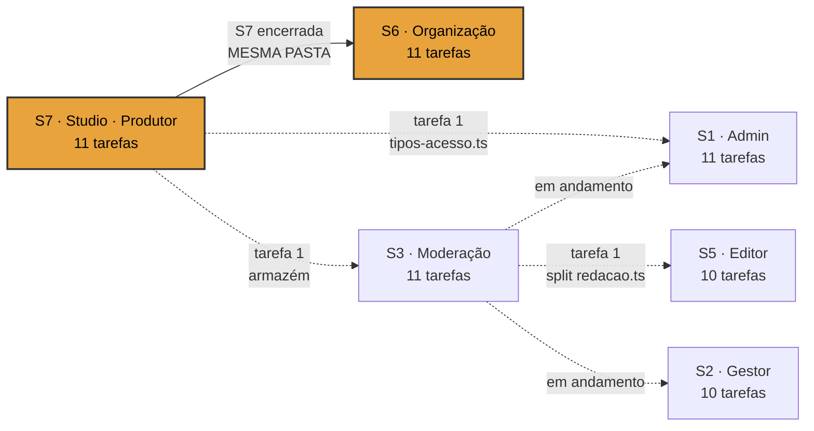

# GANTT — as 64 tarefas, com dependências

**A unidade é a tarefa, não a hora.** Não tenho base para estimar duração de tarefa nenhuma
deste projeto, e inventar hora seria o tipo de número plausível que a obra recusa. Cada
tarefa vale 1 unidade. O que o gráfico mostra é **sequência e dependência**, não prazo.

Fonte: [`TAREFAS.md`](TAREFAS.md) · Estado: [`estado/`](estado/) · Controle: [`PAINEL.md`](PAINEL.md)

---

## 1. O caminho crítico



**Linha grossa é bloqueio total. Linha tracejada é dependência de uma tarefa só.**

O caminho crítico é **S7 → S6: 22 unidades**. Todo o resto cabe embaixo disso.

| Sessão | Começa em | Termina em |
|---|---:|---:|
| S7 | 0 | 11 |
| S3 | 1 | 12 |
| S2 | 0 | 10 |
| S1 | 1 | 12 |
| S5 | 2 | 12 |
| **S6** | **11** | **22** |

**A conclusão que importa:** as quatro sessões da onda 2 terminam por volta da unidade 12. A
S6 só começa na 11. **Metade do prazo total é a S6 esperando a S7 desocupar a pasta.**

Se o prazo apertar de verdade, o único ganho grande está aí — e custaria separar
`(bastidor)/studio/` em duas pastas, `studio/produtor/` e `studio/organizacao/`, com
componentes compartilhados numa terceira. Não recomendo mudar isso agora com a S7 rodando,
mas é a alavanca, e é bom você saber que ela existe.

---

## 2. As seis linhas

```mermaid
gantt
  title 64 tarefas · a unidade é a tarefa, não a hora
  dateFormat X
  axisFormat %s

  section S7 Studio
  1 contrato e seed          :done, s7a, 0, 1
  2 P2 identidade            :active, s7b, 1, 1
  3-7 telas independentes    :s7c, 2, 5
  8 P8 revisão e envio       :s7d, 7, 1
  9 P1 painel                :s7e, 8, 1
  10 E1 E2 estendidas        :s7f, 9, 1
  11 suíte                   :s7g, 10, 1

  section S3 Moderação
  1 split de território      :done, s3a, 1, 1
  2 M1 fila                  :active, s3b, 2, 1
  3 M2 ficha do item         :s3c, 3, 1
  4 M9 histórico             :s3d, 4, 1
  5 integração com S7        :s3e, 5, 1
  6-10 telas independentes   :s3f, 6, 5
  11 suíte                   :s3g, 11, 1

  section S2 Gestor
  1 recorte do DTO           :s2a, 0, 1
  2 G1 público               :s2b, 1, 1
  3 G3 impacto D-90          :s2c, 2, 1
  4-8 telas independentes    :s2d, 3, 5
  9 G8 moderação             :s2e, 8, 1
  10 suíte                   :s2f, 9, 1

  section S1 Admin
  1 folha admin.css          :s1a, 1, 1
  2 dados admin.ts           :s1b, 2, 1
  3 A2 motor                 :s1c, 3, 1
  4-5 territórios e observ.  :s1d, 4, 2
  6 A1 papéis                :s1e, 6, 1
  7-9 auditoria e governança :s1f, 7, 3
  10 A10 moderação           :s1g, 10, 1
  11 suíte                   :s1h, 11, 1

  section S5 Editor
  1 reancorar redacao.ts     :s5a, 2, 1
  2 E1 trilha                :s5b, 3, 1
  3 E3 arestas de sentido    :s5c, 4, 1
  4 E9 assinaturas           :s5d, 5, 1
  5-8 telas independentes    :s5e, 6, 4
  9 E6 E8                    :s5f, 10, 1
  10 suíte                   :s5g, 11, 1

  section S6 Organização
  ESPERA a S7 desocupar      :crit, s6z, 0, 11
  1 ler o que a S7 deixou    :s6a, 11, 1
  2 O2 espaços               :s6b, 12, 1
  3 O1 instituição           :s6c, 13, 1
  4-7 telas independentes    :s6d, 14, 4
  8-9 editais e integração   :s6e, 18, 2
  10 O9 O10                  :s6f, 20, 1
  11 suíte                   :s6g, 21, 1
```



---

## 3. As dependências entre sessões

Só cinco, e é bom que sejam poucas — foi para isso que as pastas foram separadas.

| # | De | Para | O que trava | Condição |
|---|---|---|---|---|
| 1 | S7 tarefa 1 | S3 tarefa 5 | integração com o armazém | `tipos-acesso.ts` commitado |
| 2 | S7 tarefa 1 | S1 tarefa 6 | A1 papéis e escopos | `tipos-acesso.ts` commitado |
| 3 | S3 tarefa 1 | S5 tarefa 1 | reancorar `redacao.ts` | split commitado |
| 4 | S3 em curso | S1 tarefa 10 · S2 tarefa 9 | leitura da moderação | dado de decisão existindo |
| 5 | **S7 inteira** | **S6 inteira** | **a pasta** | S7 `estado: encerrada` |

**A condição é sempre um commit**, nunca arquivo no disco. É a regra que resolve o problema
de agora, em que 80 KB existem e ninguém sabe se estão prontos.

---

## 4. Dependências dentro de cada sessão

O que o Gantt achata em "telas independentes" está aberto no [`TAREFAS.md`](TAREFAS.md). O
padrão se repete nas seis:

```
tarefa 1  → o alicerce (contrato, split, folha, DTO)
tarefa 2  → a tela que FIXA O PADRÃO das outras
tarefas 3-9 → em leque, independentes entre si
última    → suíte e medidas
```

**A tarefa 2 é sempre a que não pode ser pulada.** É por isso que cada PRD diz por onde
começar e avisa qual escolha "natural" é erro: a A2 antes da A1, a G3 antes da G5, a O2
antes da O1, a E1 antes de tudo.

---

## 5. O que o gráfico não diz

- **Duração real.** Nenhuma. A unidade é a tarefa
- **Retrabalho por `PEDIDO` de contrato.** Cada pedido aberto pode devolver uma sessão a uma
  tarefa anterior, e há 15 lacunas de contrato previstas nos seis PRDs
- **O custo do merge.** As pastas são disjuntas, mas coerência visual entre seis superfícies
  construídas em paralelo não é garantida por pasta separada
