# Proposta de arquitetura — Agenda Cultural BR

Documento de apresentação. Responde ao **RFP §6**, que pede diagramas de Frontend, Backend,
CMS, APIs, Banco de Dados, IA, Analytics, Observabilidade e Segurança.

Base: microserviços em **AWS**, região `sa-east-1`. Todos os números do acervo citados aqui
são medidos em [`src/dados/gerado/meta.json`](../src/dados/gerado/meta.json), gerado em
22.08.2026, e reconferidos em 31.08.2026.

---

## 0. As cinco decisões que a arquitetura toma

| # | Decisão | Consequência |
|---|---|---|
| 1 | **A fronteira de serviço é a fronteira de autoria.** Cada microserviço existe porque um nível de acesso escreve uma parte da ontologia | Não há serviço "de evento" nem "de usuário": há o serviço que o Produtor escreve e o serviço que o Público escreve |
| 2 | **Oito níveis, duas visualizações, uma base de código.** Papel é dado, não alvo de build | Nenhum aplicativo novo nasce quando nasce um papel novo |
| 3 | **O grafo é a fonte da verdade; o CMS é fonte de conteúdo.** O CMS publica *para dentro* do grafo, com procedência carimbada | Trocar de CMS não reescreve o produto |
| 4 | **Escrita é transacional e única; leitura é projeção descartável** | Neptune, OpenSearch, DynamoDB e o data lake podem ser reconstruídos do zero a qualquer momento |
| 5 | **A IA propõe; humano publica.** Toda saída de modelo entra em fila com `procedencia: "ia"` e score | O sistema é auditável por construção, não por relatório |

---

## 1. O que a arquitetura precisa sustentar

### 1.1 Os oito níveis de acesso

A regra que organiza o conjunto, herdada de
[`ONTOLOGIA-E-ACESSOS.md`](../.planning/sessoes/ONTOLOGIA-E-ACESSOS.md):

> **Nenhum elemento da ontologia pode existir sem exatamente um papel autorizado a autorá-lo.
> E nenhum papel escreve sem deixar autor — admin incluído.**

Níveis de acesso não são uma camada de segurança sobre a ontologia: **são o vocabulário de
procedência**. Cada papel humano é um valor de `procedencia`, e cada escrita carimba quem
escreveu. Por isso a autorização é decisão de domínio, não de infraestrutura — e por isso ela
tem serviço próprio.

| # | Nível | Superfície | O que escreve na ontologia | Funcs. | Faixa |
|---|---|---|---|---:|---|
| 1 | **Admin** | `/admin` | governança, vocabulário de sistema, papéis e escopos | 14 | 87–100 |
| 2 | **Gestor** | `/observatorio` | **nada** — a frente inteira é leitura | 7 | 101–107 |
| 3 | **Moderador** | `/moderacao` | decisões, com autor e motivo obrigatórios | 14 | 108–121 |
| 4 | **Moderador com escopo** | `/moderacao/escopo` | o mesmo, recortado por território, tipo e fila | 4 | 122–125 |
| 5 | **Editor / Curador** | `/redacao` | sentido, assinado — tesauro, trilhas, arestas editoriais | 13 | 126–138 |
| 6 | **Organização** | `/studio` | identidade estável — instituição, espaço, programa, mídia | 14 | 139–152 |
| 7 | **Produtor cultural** | `/studio` | acontecimento — evento, temporada, ocorrência, elenco | 15 | 153–167 |
| 8 | **Público autenticado** | `/apps` — 10 apps + Conta | repertório, salvos, sinais | 62 | 1–57, 78–86 |

**167 funcionalidades no catálogo**, mais duas achadas em auditoria (168 conformidade da
equipe, 169 desempenho da moderação). Detalhe item a item em
[`funcionalidades-por-frente.md`](funcionalidades-por-frente.md).

**Studio ≠ Produtor.** Studio é a superfície; produtor é o papel. Dentro do Studio vivem dois
níveis: a Organização governa, o Produtor declara.

#### O que cada nível carrega para a arquitetura

| Nível | Exigência que ele impõe ao sistema |
|---|---|
| 1 · Admin | trilha de auditoria imutável — *admin lê, admin não apaga*; concessão de papel **com escopo**; limites de uso por organização; LGPD ponta a ponta |
| 2 · Gestor | leitura pesada e analítica sem tocar o caminho transacional; indicadores de impacto lidos de `repertorio`, **não de analytics** |
| 3 · Moderador | fila com SLA, decisão idempotente, motivo obrigatório, 47.259 arestas `semelhante_a` a revisar **por regra e amostra**, não uma a uma |
| 4 · Escopo | autorização com três eixos combináveis — território, tipo de conteúdo e fila — resolvida por requisição |
| 5 · Editor | vocabulário controlado versionado; publicação agendada; assinatura em cada aresta de sentido |
| 6 · Organização | multi-tenancy real: convite, alçada, sucessão de titularidade, chave de integração, importação em lote |
| 7 · Produtor | escrita de alta frequência com validação em tempo real e chave de identidade em três componentes; alteração dispara alerta a quem salvou |
| 8 · Público | três ordens de grandeza mais tráfego que os sete outros somados, com leitura fria e cacheável |

### 1.2 Duas visualizações, uma base de código

**A visão é estado da aplicação, não tamanho de janela.** Um `ViewProvider`
([`src/contexto/visao.tsx:14`](../src/contexto/visao.tsx#L14)) guarda `"mobile" | "web"` e
escreve `data-view` na raiz; as variantes `app:` e `desk:` respondem a esse atributo. Existe
**uma** media query no bundle inteiro.

Três consequências que valem para o produto, não só para o protótipo:

1. **Não existe componente irmão por visão.** A divergência é de layout e densidade, dentro do
   mesmo componente. Um irmão duplicaria lógica que diverge na primeira correção.
2. **Oito níveis não geram oito aplicações.** O papel e o escopo chegam do serviço de acesso e
   ligam rota e ação; o build é o mesmo. Um papel novo é uma linha de dado.
3. **O bastidor funciona no celular sem app nativo.** O produtor publica de onde estiver, com
   os mesmos componentes na visão `mobile`.

Medido: **104 rotas** em `src/app`, **53 telas de bastidor**, **5.476 páginas HTML** no build
estático do protótipo.

### 1.3 O acervo, medido

| | |
|---|---:|
| Entidades | **7.810** em 19 classes |
| Arestas | **66.563** em 11 relações |
| `semelhante_a` | **47.259** — 71% do grafo, tudo de máquina, nada revisado |
| Nós de máquina | **78%** — 4.826 `ic` + 2.937 `derivado` contra 47 `autorado` |
| Ocorrências com espaço declarado | **0 de 2.425** |
| Eventos que declaram ingresso | **0 de 300** |
| Componentes da chave de identidade sustentados | **1 de 3** — só o título |
| Ficha de acessibilidade | 5.108 declaram · **2.702 não** |

**Isso não é defeito do protótipo: é a descrição exata do que os níveis 1 a 7 existem para
inverter.** A arquitetura abaixo é o mecanismo pelo qual a plataforma deixa de derivar e passa
a saber.

---

## 2. Diagrama de contexto

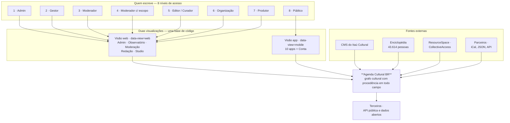

---

## 3. Diagrama de camadas — a visão que o RFP pede

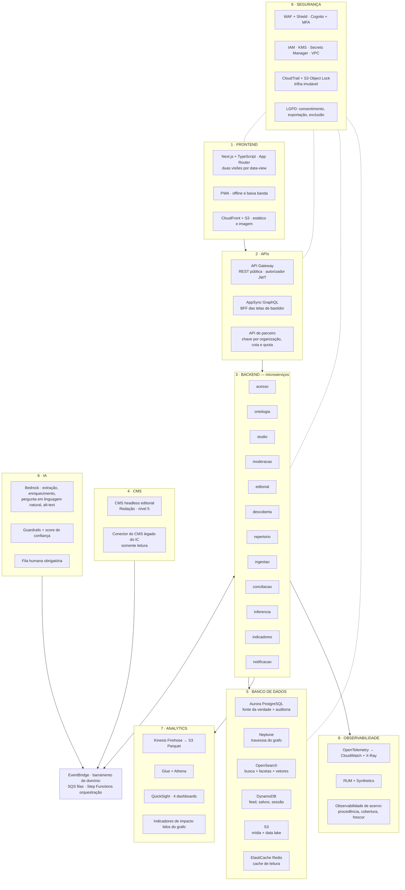

---

## 4. Frontend

**Next.js + TypeScript + Tailwind, App Router.** A mesma stack do protótipo, agora com dados
vindo de API em vez de JSON gerado no build.

| Superfície | Renderização | Por quê |
|---|---|---|
| 10 apps do público | ISR + cache de borda no CloudFront | conteúdo quase estático, tráfego de escala nacional, TTL curto só na agenda |
| Bastidor — 5 superfícies | SSR autenticado, sem cache de borda | dado de uma organização não pode encostar em cache compartilhado |
| Mapa, busca, feed | cliente sobre API, com resultado em cache | interação por manipulação direta |

**Decisões que vêm do protótipo e sobrevivem em produção:**

- **Só DTO de primitivo atravessa a fronteira servidor→cliente.** Nenhum componente de cliente
  importa o módulo de dados por valor. No protótipo isso guarda 9,4 MB de `entidades.json`; em
  produção, guarda o cliente de banco.
- **Nenhum hex novo.** Cor de linguagem vem do vocabulário, não do CSS. A mesma linguagem tem a
  mesma cor no cartão, no mapa e no indicador — cor vira informação.
- **PWA com service worker** para o modo offline e baixa banda, que o RFP pede para escala
  nacional. Não há aplicativo de loja no escopo.
- **Acessibilidade é dado, não enfeite.** As oito dimensões e a declaração explícita de ausência
  são renderizadas em toda tela que colete acessibilidade — com um ato de peso igual ao de
  salvar: *"Declaro que não oferece nenhum destes recursos."*

Hospedagem: contêiner Next em **ECS Fargate** atrás de ALB, com CloudFront à frente e o estático
em S3. O front é stateless e escala horizontalmente por CPU.

---

## 5. Backend — os microserviços e por que são esses

### 5.1 O princípio

Um monólito modular seria defensável no MVP. **A fronteira, porém, é desenhada desde o dia um
pela pergunta "quem escreve isto?"** — porque essa é a única fronteira que não muda quando o
produto cresce. Ela é a mesma da ontologia, e a ontologia é o contrato.

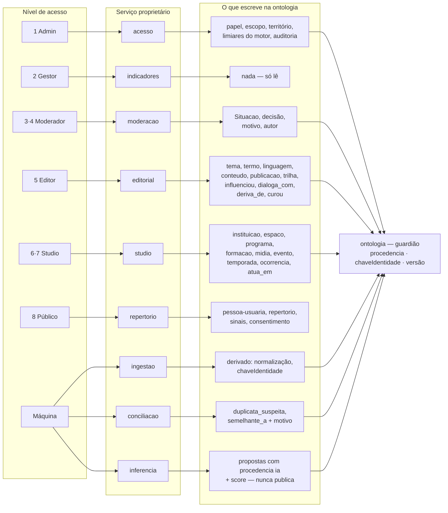

### 5.2 Os doze serviços

| Serviço | Dono | Responsabilidade | Runtime AWS | Dado |
|---|---|---|---|---|
| **acesso** | 1 | identidade, papel como aresta com escopo, alçada, chave de integração, cota | Fargate + Cognito | Aurora + DynamoDB (cache de política) |
| **ontologia** | — | **único** que escreve no acervo. Guarda `procedencia`, `chaveIdentidade`, versão e histórico. Publica evento a cada escrita | Fargate | Aurora |
| **studio** | 6, 7 | instituição, espaço, programa, formação, mídia, evento, temporada, ocorrência, elenco. Validação da chave de identidade em tempo real | Fargate | Aurora + S3 |
| **moderacao** | 3, 4 | máquina de estados da `Situacao`, filas por escopo, decisão com motivo, escalonamento, reconciliação | Fargate | Aurora + SQS |
| **editorial** | 5 | tesauro, arestas de sentido, trilha, destaque, calendário editorial. Consome o CMS headless | Fargate | Aurora + CMS |
| **descoberta** | 8 | feed por caminhada no grafo, busca unificada, facetas, mapa, explicação de toda recomendação | Fargate | Neptune + OpenSearch + Redis |
| **repertorio** | 8 | conta, salvos, sinais, trilhas próprias, consentimento e direitos do titular | Fargate | DynamoDB + Aurora |
| **ingestao** | máquina | conectores do CMS legado, Enciclopédia, ResourceSpace, iCal, JSON e API de parceiro. Normaliza e deriva | Lambda + Step Functions | S3 + Aurora |
| **conciliacao** | máquina | chave determinística primeiro, casamento probabilístico depois. Gera `duplicata_suspeita` e `semelhante_a` com motivo legível | Lambda + Batch | Aurora + OpenSearch |
| **inferencia** | máquina | extração de entidade, enriquecimento, pergunta em linguagem natural, alt-text, sugestão de trilha | Lambda + Bedrock | S3 + OpenSearch |
| **indicadores** | 2 | KPIs de produto, impacto cultural, indicadores territoriais, exportação versionada e dados abertos | Lambda agendada | Athena + Aurora |
| **notificacao** | — | alerta de alteração e cancelamento a quem salvou, lembrete, newsletter, alerta de edital | Lambda + SNS/SES/Pinpoint | DynamoDB |

**MVP são seis:** `acesso`, `ontologia`, `ingestao`, `studio`, `moderacao`, `descoberta`. Os
outros seis entram nas ondas seguintes sem mudar contrato, porque o barramento de eventos já
existe desde o primeiro deploy.

### 5.3 As portas entre níveis

Em quatro pontos um nível depende de outro. **Nenhuma pode virar beco sem saída:** cada uma tem
estado visível e caminho de volta. Isso é chamada síncrona entre contextos — e é justamente onde
microserviço mal cortado quebra. Por isso todas passam pelo barramento, como evento com estado
consultável, nunca como chamada bloqueante.

| Falta | Sai de | Vai para | Estado impresso na tela |
|---|---|---|---|
| pessoa ou obra não existe | 6, 7 | Moderador (117) | *proposta aguardando reconciliação* |
| espaço não existe | 7 | Organização (142) | *aguardando cadastro do espaço* |
| termo fora do vocabulário | 3, 6, 7 | Editor (130) | *termo proposto, em análise* |
| item fora do escopo | 4 | escopo maior (123) | *escalonado* |

---

## 6. APIs

Três superfícies, com contrato e ciclo de vida distintos.

| Superfície | Tecnologia | Consumidor | Autorização |
|---|---|---|---|
| **API pública de leitura** | REST em API Gateway, OpenAPI versionado por caminho `/v1` | app, terceiros, dados abertos | anônima com cota por IP; chave para volume |
| **BFF do bastidor** | AppSync GraphQL | 5 superfícies web dos níveis 1–7 | JWT do Cognito + escopo resolvido por requisição |
| **API de parceiro** | REST, chave por organização | importação em lote, integração de bilheteria | chave + `usage plan` com cota e limite de rajada |

**Preparação para abrir a API — a pergunta do RFP respondida por construção:**

- **Versionamento no caminho**, com política de depreciação de dois ciclos.
- **Contrato gerado da ontologia**, não escrito à mão. Classe nova no grafo é recurso novo na API.
- **Todo recurso responde com `procedencia` e `fonte`.** Dado aberto sem procedência não é dado
  aberto, é boato com CSV.
- **Idempotência obrigatória na escrita** — chave por requisição, porque o produtor publica de
  celular em rede instável.
- **Cota e limite por organização** desde o MVP, controlados pelo Admin (func. 97 e 151).
- **Toda chamada externa tem prazo.** Timeout, teto de tentativas e disjuntor: um conector de
  parceiro lento nunca derruba a ingestão inteira.

---

## 7. CMS

**Dois sistemas diferentes que a palavra "CMS" costuma esconder.**

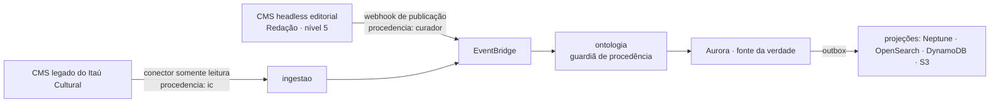

**O CMS legado é fonte, não dono.** Entra por conector somente leitura, com procedência `ic` e a
fonte registrada. Ele não define o modelo: o campo `schedules` está vazio em 100% dos eventos e
a lista `participants` contém colunistas, não elenco — modelar por ele reproduziria o erro.

**O CMS headless editorial** é a ferramenta de trabalho do nível 5. Recomendação: **Strapi
gerenciado pela equipe em Fargate**, com Aurora e S3 — a alternativa SaaS custa por seat e
prende o conteúdo editorial num contrato de terceiro, o que é exatamente o oposto do que a
proposta defende sobre dado aberto. Ele publica por webhook para o barramento; o texto vive nele,
mas **a entidade, a aresta e a procedência vivem no grafo**.

Consequência prática: **trocar de CMS não reescreve o produto.** É a diferença entre um portal
e uma infraestrutura de inteligência cultural.

---

## 8. Banco de dados

### 8.1 Persistência poliglota, com uma fonte da verdade só

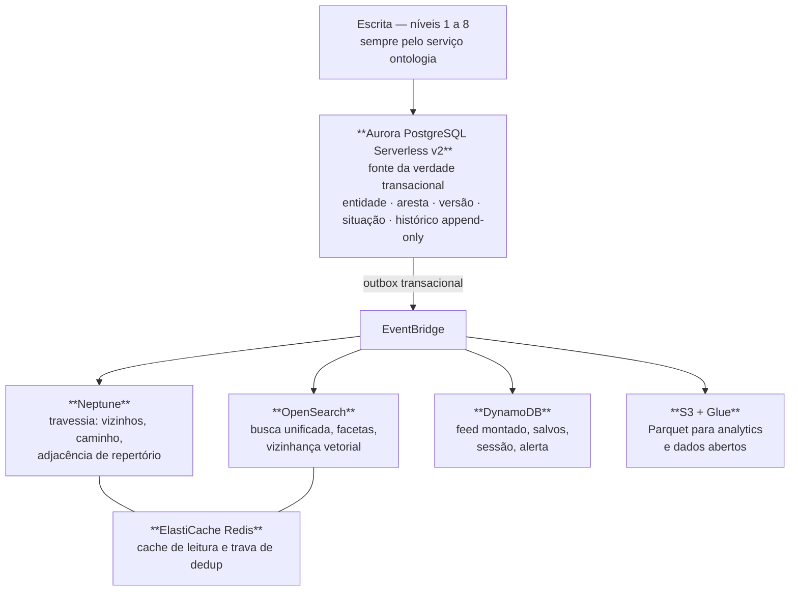

| Banco | Guarda | Por que não em outro |
|---|---|---|
| **Aurora PostgreSQL** | entidades, arestas, versões, `Situacao`, histórico, papéis, consentimento | é onde a escrita precisa de transação e de chave única — a chave de identidade é restrição de banco, não validação de formulário |
| **Neptune** | o grafo para travessia | 66.563 arestas hoje, milhões na escala. `caminho` e `vizinhos` em SQL viram junção recursiva que degrada com o grau do nó |
| **OpenSearch** | índice unificado + k-NN | busca em agenda, acervo, editorial e verbete num só índice, com facetas derivadas da ontologia |
| **DynamoDB** | leitura quente do público | latência previsível no feed e nos salvos, no volume do nível 8 |
| **S3** | mídia original, Parquet, exportação versionada | armazenamento barato e imutável, com Object Lock onde a trilha exige |
| **Redis** | cache e trava | evita o efeito manada na revalidação e serializa a decisão de duplicata |

### 8.2 Por que projeção, e não banco único

**As leituras são descartáveis; a escrita não.** Neptune, OpenSearch, DynamoDB e o data lake são
reconstruíveis a partir do Aurora por reprocessamento do barramento — o mesmo mecanismo da
funcionalidade 95, *reprocessamento do grafo*. Isso responde a "como crescer sem reescrever":
**trocamos um motor de leitura sem tocar em regra de negócio.**

O gerador do protótipo já prova o princípio: `npm run gerar-grafo` é determinístico, byte a byte,
e valida invariantes antes de escrever qualquer coisa. Um grafo inválido nunca chega ao disco.

### 8.3 Os campos que o sistema escreve e ninguém digita

`procedencia`, `chaveIdentidade` e `coordenada` **nunca são editáveis por formulário**. São
carimbados pelo serviço `ontologia`. É o que sustenta a auditoria e a dedução defensável de
duplicata.

### 8.4 A máquina de estados que faz a jornada existir

Sem `Situacao` o Studio é um formulário: o produtor preenche, aperta um botão e nada muda de
lugar. Com ela, o mesmo registro é lido por dois níveis diferentes — o produtor vê *enviado*, o
moderador vê *na fila* — e é essa leitura dupla que prova que os oito níveis se conversam.

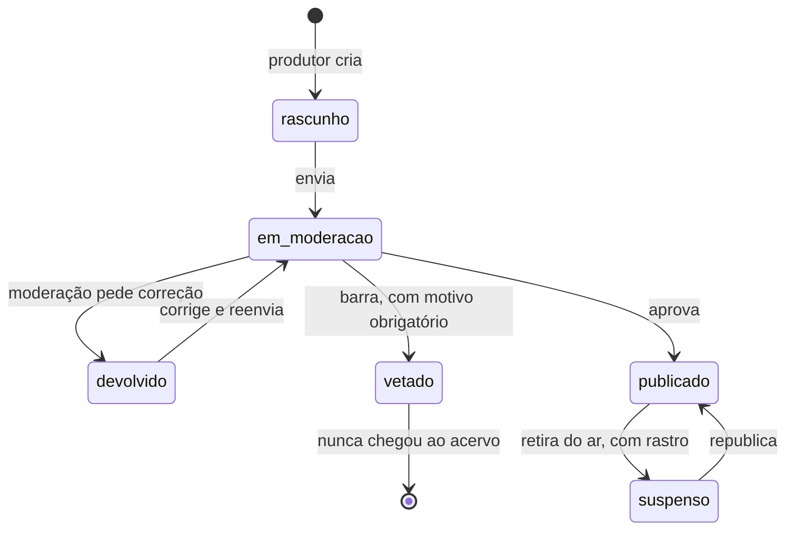

**`vetado` e `suspenso` não são o mesmo estado.** Vetar barra o que nunca entrou; suspender
retira o que estava no ar. Trocar um pelo outro faria o histórico registrar uma publicação que
não houve.

---

## 9. IA

### 9.1 Onde entra

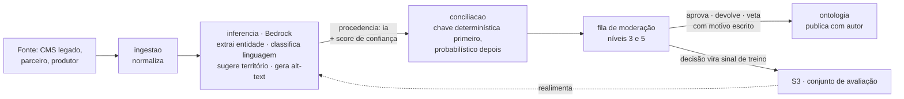

| Uso | Serviço AWS | Por quê |
|---|---|---|
| Extração de entidade do acervo | Bedrock | 14 anos de artistas presos em HTML — o maior ganho imediato |
| Enriquecimento na ingestão | Bedrock + Comprehend | normalizar, classificar linguagem, sugerir território |
| Casamento probabilístico de duplicata | OpenSearch k-NN + Bedrock | **depois** da chave determinística, nunca antes |
| Pergunta em linguagem natural virando consulta | Bedrock | cenário 5 do RFP, com a tradução mostrada ao usuário |
| Sugestão de trilha ao curador | Bedrock | sugere; quem assina é humano |
| Descrição alternativa de imagem | Bedrock multimodal | 21% do acervo sem alt-text |

### 9.2 Onde não entra — o RFP pergunta isso explicitamente

- Não publica nada sem revisão humana
- Não define destaque editorial
- Não escreve verbete de Enciclopédia
- Não decide ranking comercial
- Não substitui mediação cultural

**Transparência por construção:** toda saída carrega `procedencia: "ia"` e score visível. Toda
recomendação é explicável em linguagem comum — a aresta `semelhante_a` carrega `motivo` legível
em português, e aresta sem motivo é erro de geração, não item a preencher depois. É isso que
permite a tela dizer *"parecido porque os dois são eventos, de artes visuais, em São Paulo"* em
vez de exibir um ranking opaco.

**Feedback humano:** a decisão na fila é sinal de treino, gravado com autor e motivo. O sistema
aprende com quem tem autoridade cultural, não com clique.

**Guardrails do Bedrock** ficam ligados na saída, e o modelo roda em VPC endpoint — nenhum
prompt com dado de titular sai da rede privada.

---

## 10. Analytics

Duas trilhas, deliberadamente separadas.

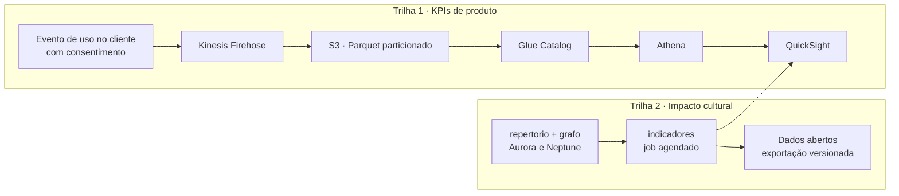

**Impacto cultural não sai de analytics.** Sai de `repertorio`, que é entidade de primeira classe
desde o dia um, porque métrica de impacto não pode ser puxadinho de analytics.

| Indicador | Como se mede |
|---|---|
| Ampliação de repertório | nº de linguagens distintas no `Repertorio` ao longo do tempo |
| Descoberta de novo artista | primeira interação com agente sem histórico prévio |
| Diversidade de linguagem | entropia da distribuição por usuário e por região |
| Circulação territorial | eventos frequentados fora do bairro de origem |
| Alcance da gratuidade | proporção gratuito × pago no que é efetivamente consumido |

**Quatro dashboards, quatro públicos:** editorial, produto, parceiro e institucional (func. 101).
E dois painéis que só existem porque a procedência existe: **procedência com as três fatias
contadas** (105) e **ausência declarada com denominador** (106) — a tela que diz *"2.702 de 7.810
não declaram acessibilidade"* em vez de omitir.

---

## 11. Observabilidade

**Duas observabilidades, e a segunda é a que diferencia a proposta.**

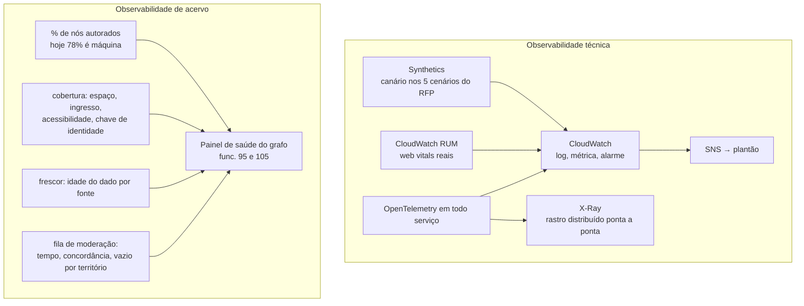

| Sinal técnico | Meta |
|---|---|
| Disponibilidade da API pública | 99,9% mensal |
| Latência p95 de leitura | < 300 ms na borda |
| Latência p95 de escrita no Studio | < 800 ms |
| Erro de conector de ingestão | alarme na primeira falha, disjuntor na terceira |
| Rastro | 100% das requisições correlacionadas por `trace-id` até o banco |

| Sinal de acervo | Por que é alarme, não relatório |
|---|---|
| % de nós de máquina subindo | o produto está derivando mais do que sabendo — é regressão do argumento central |
| Fila de moderação por território | fila centralizada em SP reproduz na governança o deserto que o mapa denuncia |
| Cobertura de espaço declarado em ocorrência | hoje 0 de 2.425; se não sobe, o nível 7 não está sendo usado |
| Frescor por fonte | conector calado é indistinguível de parceiro sem evento — precisa de sinal próprio |

**A armadilha que já custou caro no protótipo, e que vira regra em produção:** sete vezes um
portão passou com a tela visivelmente quebrada, e **todas as sete foram pegas por captura de
tela, nenhuma por número**. Por isso os canários do Synthetics medem retângulo contra contêiner
e guardam a imagem, não só o código HTTP.

---

## 12. Segurança e LGPD

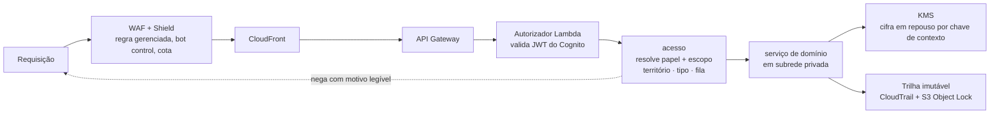

### 12.1 Camadas

| Camada | Controle |
|---|---|
| Borda | WAF com regras gerenciadas, Shield, cota por IP e por chave, CloudFront com OAC |
| Identidade | Cognito com MFA obrigatório para os níveis 1 a 7; federação com o diretório do IC |
| Autorização | **papel é aresta com escopo** — território + classe + fila, resolvidos por requisição, com decisão registrada |
| Rede | VPC com subredes privadas, sem IP público em serviço; VPC endpoints para S3, Bedrock e Secrets Manager |
| Segredo | Secrets Manager com rotação; nenhuma credencial em variável de ambiente de imagem |
| Dado | KMS em repouso, TLS 1.3 em trânsito, cifra por contexto de organização |
| Postura | GuardDuty, Security Hub, Inspector, AWS Config com regras de conformidade |
| Trilha | CloudTrail + trilha de domínio em S3 com Object Lock — **admin lê, admin não apaga** (func. 93) |

### 12.2 Multi-tenancy

Cada organização é um limite de isolamento lógico: `organizacao_id` em toda linha, política de
linha no Postgres, e o mesmo identificador na chave de cifra e no prefixo do S3. **Um produtor
nunca alcança registro de outra organização, mesmo com bug de aplicação** — a negativa vem do
banco, não do código.

### 12.3 LGPD, sem enfeite

| Direito do titular | Como se cumpre |
|---|---|
| Consentimento | registrado com versão do texto, momento e finalidade; revogável na Conta |
| Acesso e portabilidade | exportação sob demanda, JSON e CSV, entregue por link expirável |
| Exclusão | apaga o titular e pseudonimiza o sinal; **`repertorio` agregado sobrevive sem a pessoa** |
| Correção | pelo próprio titular na Conta |
| Retenção | política por classe de dado, com expurgo automático no S3 e no Aurora |
| Encarregado | fila própria de resposta ao titular, com prazo medido (func. 94) |

**Residência:** tudo em `sa-east-1`. Nenhum dado de titular sai da região, inclusive nos prompts
para o Bedrock.

### 12.4 A barreira que vale mais que qualquer controle técnico

O Studio **lê e nunca edita** `pessoa`, `coletivo` e `obra` — são 43.614 pessoas reais na base
completa, que nunca se cadastraram. Um produtor editar o verbete de um artista real seria a
violação exata que o projeto se proibiu. O único caminho de escrita é a **reconciliação**, que
passa pelo moderador.

Da mesma forma: **elenco declarado passa por moderação** (func. 116), porque afirmar que uma
pessoa real participou de um evento é afirmação sobre terceiro.

---

## 13. Infraestrutura AWS

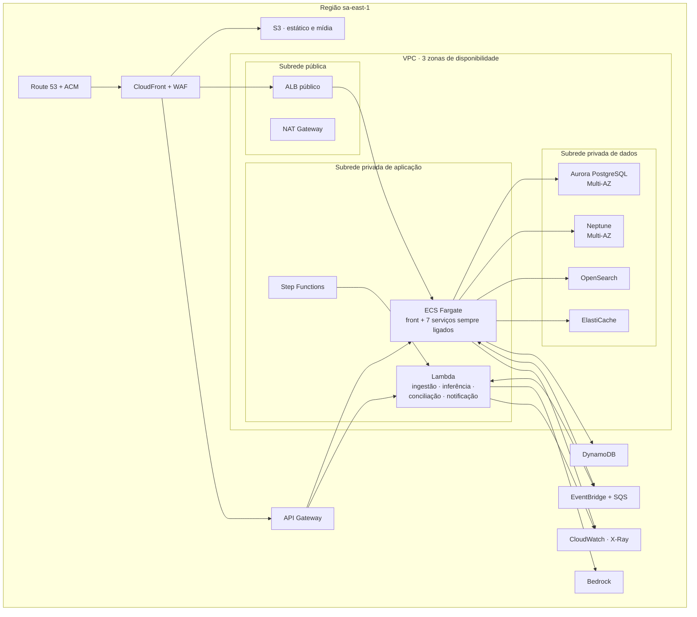

| Assunto | Escolha |
|---|---|
| Infra como código | AWS CDK em TypeScript — a mesma linguagem do produto, um repositório |
| Ambientes | `dev`, `homologação` e `produção` em contas separadas, sob AWS Organizations |
| Entrega | GitHub Actions → ECR → ECS *blue/green*; migração de banco versionada e reversível |
| Bandeira de funcionalidade | AppConfig — publicar superfície e desligar superfície é funcionalidade do Admin (99) |
| Custo | Fargate Spot nos jobs, Aurora Serverless v2 com piso baixo, S3 Intelligent-Tiering, orçamento com alarme |
| Continuidade | Multi-AZ em tudo que guarda estado; RPO 5 min, RTO 1 h; restauração testada por trimestre |

---

## 14. Como crescemos sem reescrever

| Fase | O que entra | O que a arquitetura ganha | Marco de saída |
|---|---|---|---|
| **MVP** | 6 serviços · grafo mínimo · ingestão do acervo · app com 5 abas · Studio e Moderação básicos | barramento de eventos e procedência desde o primeiro deploy | uma pessoa descobre, salva e vai a um evento que não buscou |
| **Piloto** | `conciliacao`, `editorial`, `notificacao` · uma região · 20–30 instituições | dedup em produção e alerta de ocorrência | produtores publicam sozinhos e a duplicata cai abaixo do limiar |
| **Escala nacional** | `indicadores`, `inferencia` completa · ingestão federada · curadoria territorial delegada · offline | leitura projetada e cache de borda absorvem o tráfego nacional | cobertura nas capitais e indicadores territoriais publicáveis |
| **Plataforma expandida** | API pública e dados abertos · Enciclopédia como serviço de autoridade | o contrato gerado da ontologia vira produto | o grafo vira infraestrutura que outros consomem |

**O que muda de valor sozinho quando os oito níveis entram no ar** — e cada linha é uma tela do
Observatório mudando sem ninguém tocar em código:

| | Hoje | Depois | Quem move |
|---|---|---|---|
| `ocorrencia` | 2.425 `derivado` | `produtor` | 7 |
| Espaço declarado | 0 de 2.425 | declarado | 6, 7 |
| Ingresso declarado | 0 de 300 | declarado | 7 |
| Componentes da chave | 1 de 3 | 3 de 3 | 7 |
| Elenco em evento datado | 0 de 129 | declarado | 7 |
| Acessibilidade | 2.702 não declaram | declarada, inclusive a ausência | 6, 7 |
| Nós de máquina | **78%** | cai a cada publicação | 5, 6, 7 |
| `programa` | 0 instâncias | povoado | 6 |
| `influenciou` `deriva_de` `curou` | 0 arestas | autoradas e assinadas | 5 |
| `semelhante_a` revisada | 0 de 47.259 | revisada por regra | 3 |

---

## 15. Riscos da arquitetura, declarados

| Risco | Mitigação |
|---|---|
| **Doze serviços é caro cedo demais** | o MVP roda seis; a fronteira é desenhada desde o começo, o deploy não |
| **Neptune é operação especializada** | o Aurora continua sendo a fonte da verdade — se Neptune sair, a travessia degrada para consulta recursiva, o produto não cai |
| **A fila de moderação vira gargalo humano** | revisão por regra e por amostra nas 47.259 arestas, fila priorizada por vazio e não por volume, delegação temporária de escopo |
| **Custo de Bedrock na ingestão de 14 anos de acervo** | extração é lote, não tempo real; roda uma vez por fonte, com cache por hash de documento e teto de orçamento com alarme |
| **Dado de terceiro sem consentimento** | pessoa e obra são somente leitura no Studio; escrita só por reconciliação com moderação |
| **Consistência eventual visível ao usuário** | quem escreve lê da própria escrita pelo write model; projeção só serve leitura de terceiro |

---

## Fontes

- [`docs/PRD.md`](PRD.md) — §6 ontologia, §7 arquitetura de informação, §10 IA, §11 métricas, §12 roadmap
- [`docs/ARQUITETURA.md`](ARQUITETURA.md) — como o protótipo funciona por dentro
- [`.planning/sessoes/ONTOLOGIA-E-ACESSOS.md`](../.planning/sessoes/ONTOLOGIA-E-ACESSOS.md) — a matriz de quem escreve o quê
- [`docs/niveis/`](niveis/) — um documento por nível de acesso
- [`docs/funcionalidades-por-frente.md`](funcionalidades-por-frente.md) — as 167 funcionalidades
- [`src/dados/gerado/meta.json`](../src/dados/gerado/meta.json) — todos os números medidos
